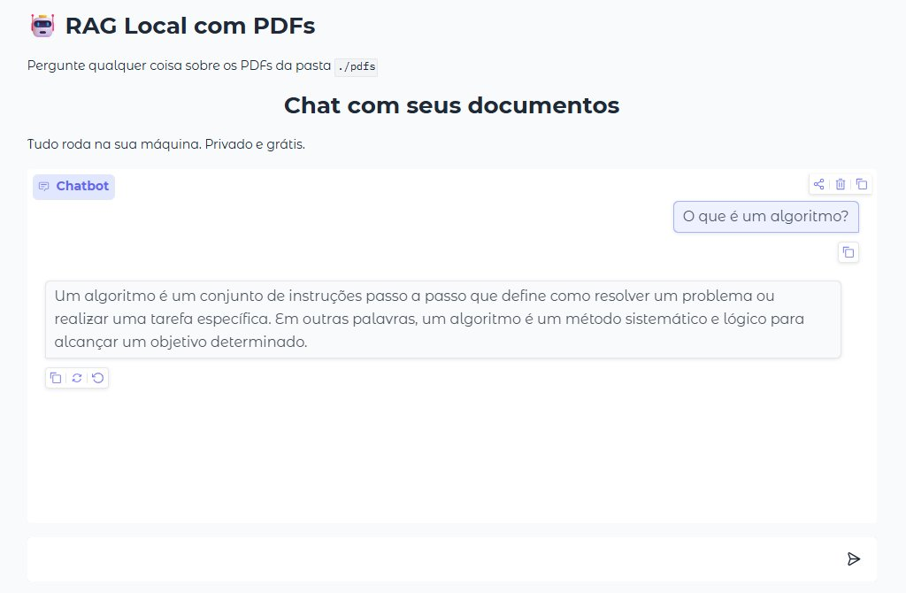

# 🤖 Local RAG with PDFs  
**Your own private AI that reads any PDF — 100% local, free, and private**

  

A simple yet powerful project built for developers transitioning to **AI Engineer** in 2026.

In under 30 minutes, you’ll create an intelligent assistant that answers questions about **your own documents** using only your computer’s power.

---

## ✨ What is this project?

A complete **local RAG (Retrieval-Augmented Generation)** system:
- Automatically loads all PDFs from the `pdfs/` folder
- Indexes them with embeddings
- Answers questions based **only** on the content of your documents
- Beautiful web interface powered by Gradio

Perfect for:
- Content creators (answering questions about your own videos/articles)
- Students (exam rules, textbooks, notes)
- Developers who want to understand RAG hands-on

---

## 🚀 Tech Stack (2026 standard)

- **Ollama** → Local LLMs (llama3.2 / qwen2.5)
- **LangChain** → RAG orchestration
- **Chroma** → Persistent vector database
- **Hugging Face** → Embeddings (`nomic-embed-text`)
- **Gradio** → Interactive web UI
- Python 3.10+

---

## 📋 How to Run (Step-by-Step)

### 1. Clone the repository
```bash
git clone https://github.com/dionisioedu/rag-local-pdf.git
cd rag-local-pdf
```

### 2. Install OllamaDownload from ollama.com and run:bash
```bash
ollama pull nomic-embed-text
ollama pull llama3.2
```

### 3. Create virtual environmentbash
```bash
python -m venv venv
```
# Windows
```bash
venv\Scripts\activate
```
# macOS / Linux
```bash
source venv/bin/activate
```

### 4. Install dependenciesbash
```bash
pip install -r requirements.txt
```

### 5. Add your PDFsPlace any PDF files inside the pdfs/ folder.6. Run the appbash
```bash
python app.py
```
Open: http://127.0.0.1:7860

##### Project Structure
```bash
rag-local-pdf/
├── pdfs/              # ← Put your PDFs here
├── chroma_db/         # (created automatically)
├── app.py             # Main code
├── requirements.txt
├── README.md
└── article-rag.md     # Full article for blog/YouTube
```